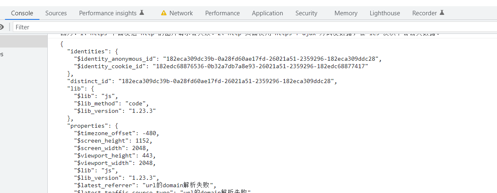

# H5 SDK接入方法


接入步骤

1、从 百度网盘上获取微信小程序 SDK 源码；
链接: https://pan.baidu.com/s/1DmteU2Uoh6kFS2zJntoHiw 提取码: gyx5 

或从github下载：https://github.com/deeplinktech/deeplink-sdk/tree/main/h5-sdk/utils

2、将 sdk文件dp.min.js 和配置文件dp_config.js文件放入h5项目中，建议放到独立于业务的文件夹；
其中，dp_config.js配置如下（config文件会引入sdk文件）：

```js
(function(para) {
    var p = para.sdk_url,
        n = para.name,
        w = window,
        d = document,
        s = 'script',
        x = null,
        y = null;
    w['deepLinkAnalytic2022'] = n;
    w[n] = w[n] || function(a) {
        return function() {
            (w[n]._q = w[n]._q || []).push([a, arguments]);
        }
    };
    var ifs = ['track', 'quick', 'register', 'registerPage', 'registerOnce', 'clearAllRegister', 'trackSignup', 'trackAbtest', 'setProfile', 'setOnceProfile', 'appendProfile', 'incrementProfile', 'deleteProfile', 'unsetProfile', 'identify', 'login', 'logout', 'trackLink'];
    for (var i = 0; i < ifs.length; i++) {
        w[n][ifs[i]] = w[n].call(null, ifs[i]);
    }
    if (!w[n]._t) {
        x = d.createElement(s), y = d.getElementsByTagName(s)[0];
        x.async = 1;
        x.src = p;
        w[n].para = para;
        y.parentNode.insertBefore(x, y);
    }
})({
    /** 配置项部分 **/
    // jssdk路径，如果sdk是放在cdn/服务器上的，可以通过https://xxx.xxx.com/dp.min.js引入
    sdk_url: './dp.min.js',
    // 自定义sdk名称，埋点上报使用
    name: 'dpSdk',
    // 数据上报的的服务器地址
    server_url: 'https://receive-sdk-day-data-formal-dyefxaabxx.cn-hangzhou.fcapp.run/sa.gif',
    heatmap: {
        //是否开启点击图，default 表示开启，自动采集 $WebClick 事件，可以设置 'not_collect' 表示关闭。
        clickmap: 'default',
        //是否开启触达注意力图，not_collect 表示关闭，不会自动采集 $WebStay 事件，可以设置 'default' 表示开启。
        scroll_notice_map: 'not_collect'
    },
    // 是否开始调试
    show_log: true
        /** 配置项部分 **/
});
// 页面曝光上报
dpSdk.quick('autoTrack');
```

3、在 index.html 文件中通过 <script></script>标签引入 JS配置文件。
```js
// index.html
<script src="./sensors_config.js"></script>
```
4、验证测试，当在开启show_log的条件下，打开chrome开发者工具打印出如下日志，表示配置成功。

<div align=center>
    
</div>

