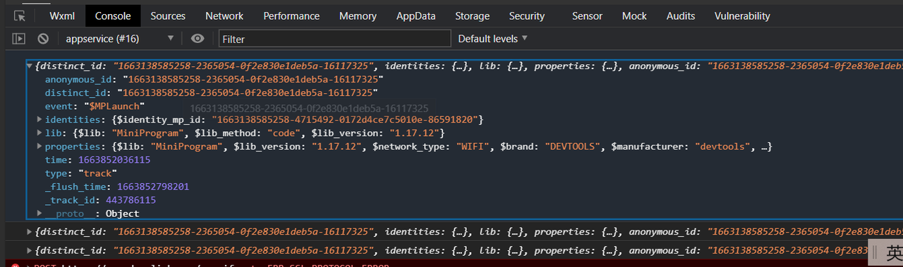

# 小程序SDK接入方法

接入步骤

## 1.下载小程序sdk包；
下载地址： https://github.com/deeplinktech/deeplink-sdk

## 2.将sdk文件dp.min.js 和配置文件dp_config.js文件放入小程序项目中，建议放到utils文件夹；其中，dp_config.js配置如下：

```js
var conf = {
  // 注册在APP全局函数中的变量名，在非app.js中可以通过getApp().dp(你这里定义的名字来使用)
  name: 'dp',
  // 如果要通过sdk自动获取openid，需要在代码中配置appid和appsercret，并在这里标志appid,不需要的话，非必填。
  appid: 'xxxxx',
  // 分析数据接收地址
  // server_url: 'https://xxxxx.xxxx.xxxx/sa.gif?project=default&token=27eeee',
  server_url: 'server_url: 'https://receive-sdk-day-data-formal-dyefxaabxx.cn-hangzhou.fcapp.run/sa.gif',
  // 自定义渠道追踪参数，如 source_channel: ["custom_param"],非必填
  source_channel:['utm_source'],
  //默认使用队列发数据时候，两条数据发送间的最大间隔
  send_timeout: 1000,
  // 发送事件的时间使用客户端时间还是服务端时间
  use_client_time: false,
  // 是否允许控制台打印查看埋点数据（建议开启查看）
  show_log: true,
  // 是否允许修改onShareMessage里return的path，用来增加（用户id，分享层级，当前的path），在app onshow中自动获取这些参数来查看具体分享来源，层级等
  allow_amend_share_path: true,
  // 是否自动采集如下事件（建议开启）
  autoTrack: {
    appLaunch: true, //是否采集 $MPLaunch 事件，true 代表开启。
    appShow: true, //是否采集 $MPShow 事件，true 代表开启。
    appHide: true, //是否采集 $MPHide 事件，true 代表开启。
    pageShow: true, //是否采集 $MPViewScreen 事件，true 代表开启。
    mpClick: true, // 默认为 false，true 则开启 $MPClick 事件采集 
    pageShare: true //是否采集 $MPShare 事件，true 代表开启。
  },
  // 是否集成了插件！重要！
  is_plugin: false
};
module.exports = conf; 
``` 

## 3、在 app.js 文件中通过 require() 引入 SDK
```js
// app.js
var dpSdk = require('./utils/dp.min');
var conf = require('./utils/dp_config.js');
dpSdk.setPara(conf);
dpSdk.init();
```
建议通过 require 或 import 引入 SDK 后，立即调用 setPara() 来配置初始化参数，防止延迟配置导致元素点击事件处理函数无法被代理，预置元素点击事件无法采集；

在调用 init() 接口之前，采集的数据被缓存在内存中；调用 init() 接口后，会将缓存的数据通过网络发送出去。

## 4、绑定小程序openid（非必需）
```js
// 初始化 SDK，下面2选1
if(不使用 openid 作为匿名 ID){
    dpSdk.init();
}
// 如果需要使用 openid 作为匿名 ID，请单独获取 openid 之后调用 dpSdk.setOpenid() 方法
wx.request({
    url: '后端获取 OpenID 的请求',success: function(res){if(res.OpenID){
            dpSdk.setOpenid(res.OpenID); 
        }},complete: function(){// 如果获取 openid 失败，SDK 会以 UUID 作为匿名 ID 发数据
        dpSdk.init();}
});
```


## 5、添加公共属性，公共属性会在每一次上报中携带字段信息。（非必需）
```js
getApp().dpSdk.registerApp({
        comp: '喔图',
        id: 123
});
```


## 6、验证测试，当在开启show_log的条件下，微信开发者工具打印出如下日志，表示配置成功。
<div align=center>
    
</div>